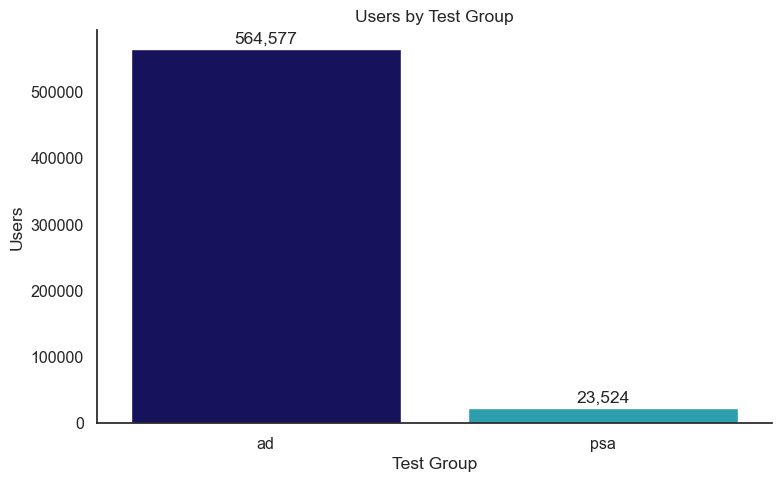
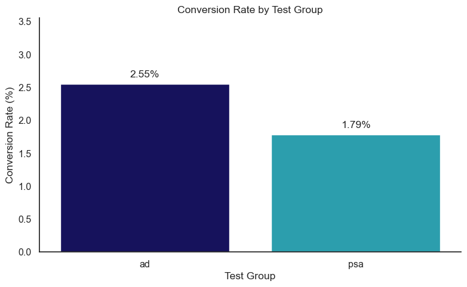
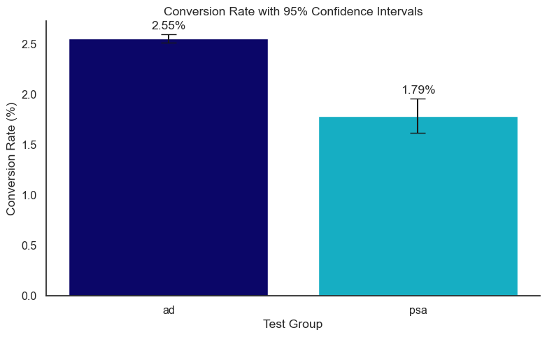
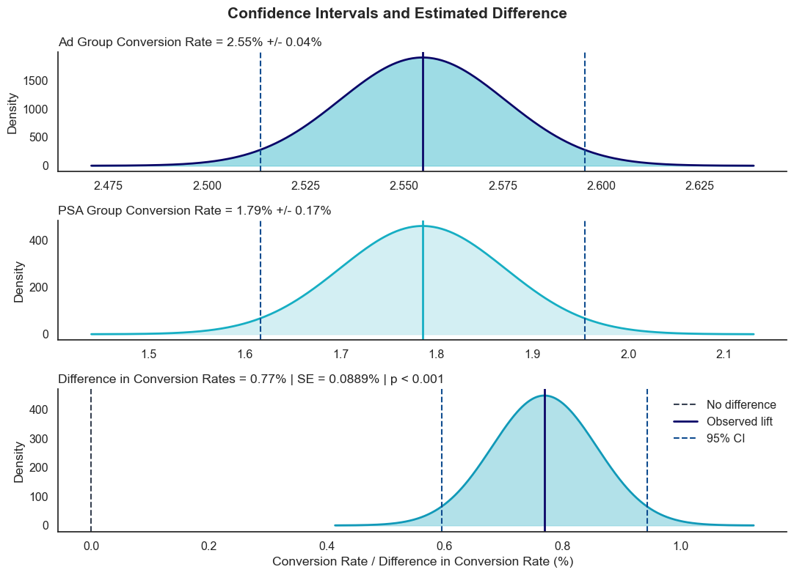
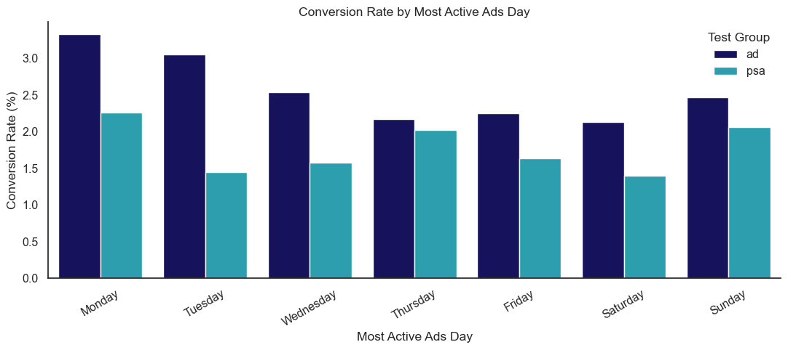
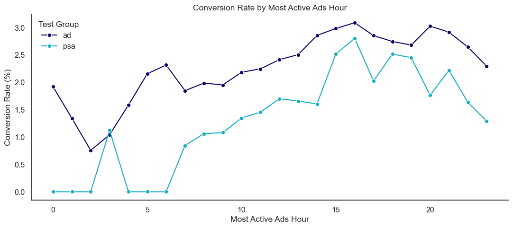
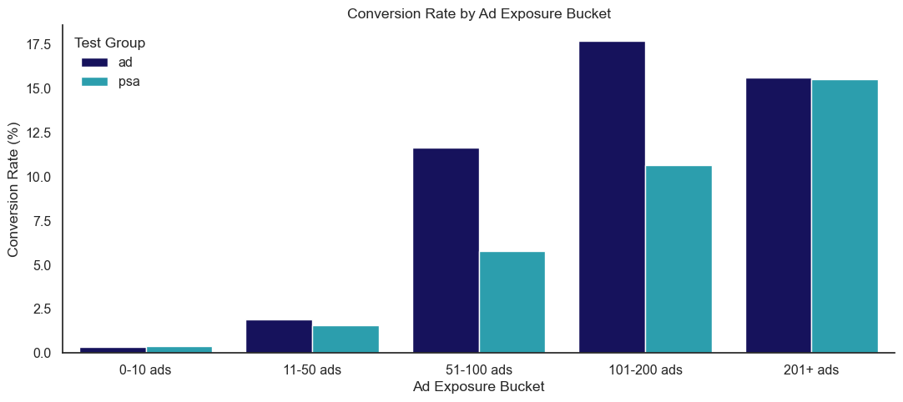
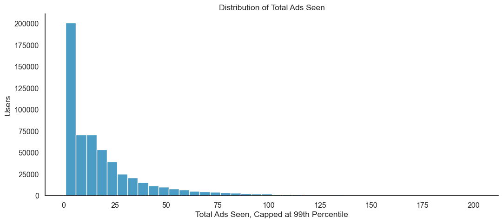

# A/B Testing: Digital Advertising Campaign

This project analyzes whether a digital advertising campaign increased user conversion compared with a control group. The treatment group saw advertisements, while the control group saw public service announcements.

The goal is to evaluate whether the campaign produced a statistically significant improvement in conversion rate and translate the result into a clear business recommendation.

## Business Question

Did the advertising campaign increase user conversion compared with the control group?

## Tools Used

- PostgreSQL
- Python
- pandas
- SQLAlchemy
- statsmodels
- matplotlib
- seaborn
- Jupyter Notebook

## Hypothesis

**Null hypothesis:** There is no difference in conversion rate between the ad group and the PSA group.

**Alternative hypothesis:** There is a difference in conversion rate between the ad group and the PSA group.

Primary metric:

`Conversion Rate = Converted Users / Total Users`

## Dataset

The dataset contains user-level A/B testing records, including:

- `test_group`: ad or PSA group
- `converted`: whether the user converted
- `total_ads`: number of ads shown
- `most_ads_day`: day with highest ad exposure
- `most_ads_hour`: hour with highest ad exposure

Total records analyzed: **588,101 users**

## Key Results

| Metric | Ad Group | PSA Group |
|---|---:|---:|
| Users | 564,577 | 23,524 |
| Conversions | 14,423 | 420 |
| Conversion Rate | 2.55% | 1.79% |

Additional results:

| Metric | Value |
|---|---:|
| Absolute lift | 0.77 percentage points |
| Relative lift | 43.09% |
| Z-statistic | 7.37 |
| P-value | p < 0.001 |
| 95% CI for difference | 0.60% to 0.94% |

The ad group converted at a significantly higher rate than the PSA group.

## Visual Analysis

### Users by Test Group



The ad group was much larger than the PSA group. This imbalance should be considered when interpreting segment-level results.

### Conversion Rate by Test Group



The ad group had a conversion rate of **2.55%**, compared with **1.79%** for the PSA group.

### Conversion Rate with 95% Confidence Intervals



The confidence intervals support that the ad group performed better than the PSA group.

### Confidence Intervals and Estimated Difference



The observed difference in conversion rates was **0.77 percentage points**. The 95% confidence interval for the difference ranged from **0.60% to 0.94%**, fully above zero, which supports a statistically significant positive campaign effect.

### Conversion Rate by Most Active Ads Day



The ad group generally outperformed the PSA group across most days of the week. Monday and Tuesday showed especially strong ad-group conversion performance.

### Conversion Rate by Most Active Ads Hour



Conversion rates varied throughout the day, with stronger performance during later hours. Some PSA hourly values should be interpreted carefully because the PSA group has a smaller sample size.

### Conversion Rate by Ad Exposure Bucket



Users with higher ad exposure showed higher observed conversion rates. This should be interpreted as an association, not direct causation, because more active users may naturally see more ads.

### Distribution of Total Ads Seen



The distribution is right-skewed. Most users saw a relatively low number of ads, while a smaller group received much higher exposure.

## Statistical Test

A **two-proportion z-test** was used because the outcome variable, `converted`, is binary.

Result:

`Z-statistic = 7.37`

`P-value = p < 0.001`

Because the p-value is below 0.05, the null hypothesis is rejected. The difference in conversion rates is statistically significant.

## Key Insights

- The advertising campaign increased conversion compared with the PSA control group.
- The ad group achieved a **43.09% relative lift** over the PSA group.
- The confidence interval for the lift was fully positive, supporting a real campaign effect.
- Ad performance was generally stronger across most days and hours.
- Higher ad exposure was associated with higher conversion, but this does not prove that more ads directly caused conversion.

## Business Recommendation

The advertising campaign should be considered successful based on the available data. The campaign produced a statistically significant increase in conversion rate and should be continued or used as a baseline for future campaign testing.

Before increasing budget significantly, the business should also evaluate:

- cost per conversion
- revenue per conversion
- profit margin
- return on ad spend
- long-term customer value

## Conclusion

The A/B test provides strong evidence that the digital advertising campaign improved conversion.

The ad group converted at **2.55%**, while the PSA group converted at **1.79%**. This represents an **absolute lift of 0.77 percentage points** and a **relative lift of 43.09%**.

The result was statistically significant, with a **z-statistic of 7.37** and **p < 0.001**. The 95% confidence interval for the difference in conversion rates ranged from **0.60% to 0.94%**, which is fully above zero.

Based on these results, the advertising campaign can be considered effective. However, before increasing campaign budget, the business should also evaluate cost per conversion, revenue per conversion, profit margin, and return on ad spend.

## Project Files

```text
ab-testing-digital-ad-campaign/
├── README.md
├── python-code/
│   └── ab_test_analysis.py
├── python-notebook/
│   └── ab_test_analysis.ipynb
├── sql-queries/
│   ├── 01_create_table.sql
│   └── 02_analysis_queries.sql
├── visuals/
│   ├── users_by_test_group.png
│   ├── conversion_rate_by_test_group.png
│   ├── conversion_rate_95_confidence_intervals.png
│   ├── confidence_intervals_estimated_difference.png
│   ├── conversion_rate_by_ads_day.png
│   ├── conversion_rate_by_ads_hour.png
│   ├── conversion_rate_by_ad_exposure_bucket.png
│   └── total_ads_seen_distribution.png
└── report/
    └── ab_testing_report.docx
## Conclusion

The A/B test provides strong evidence that the digital advertising campaign improved conversion.

The ad group converted at **2.55%**, while the PSA group converted at **1.79%**. This represents an **absolute lift of 0.77 percentage points** and a **relative lift of 43.09%**.

The result was statistically significant, with a **z-statistic of 7.37** and **p < 0.001**. The 95% confidence interval for the difference in conversion rates ranged from **0.60% to 0.94%**, which is fully above zero.

Based on these results, the advertising campaign can be considered effective. However, before increasing campaign budget, the business should also evaluate cost per conversion, revenue per conversion, profit margin, and return on ad spend.
