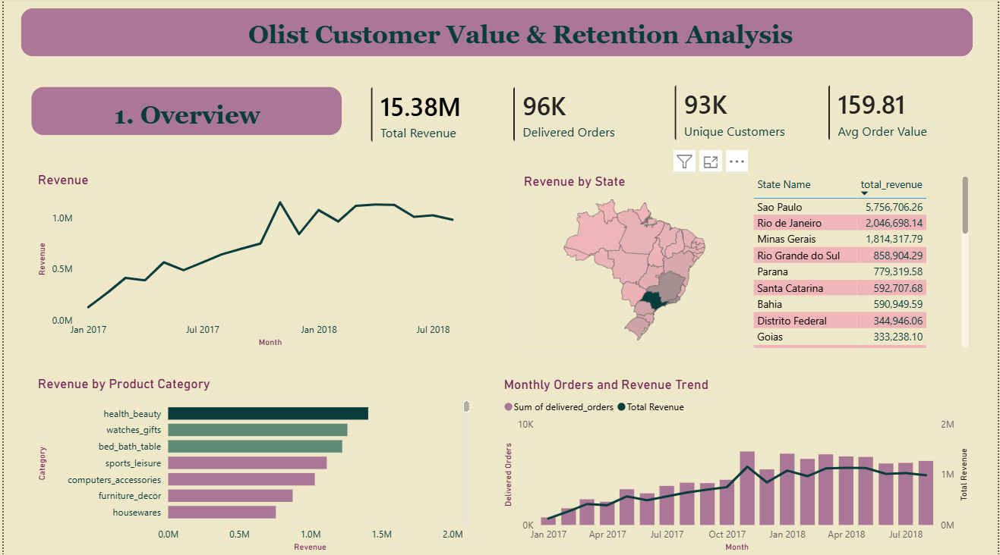
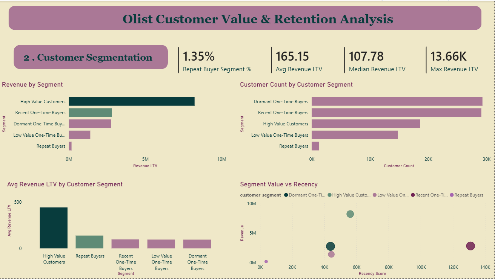
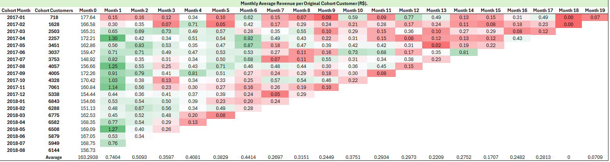
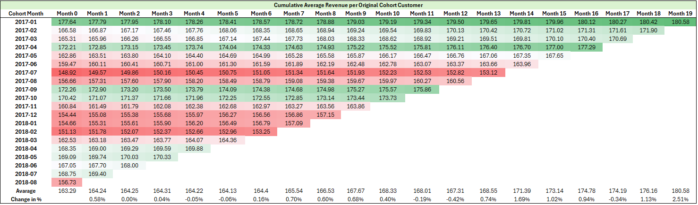
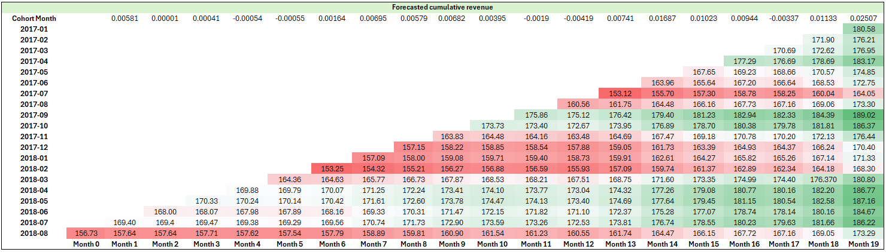

# Olist Customer Value & Retention Analysis

Advanced SQL and Power BI portfolio project analyzing customer value, revenue behavior, cohort performance, and customer segmentation using the Brazilian E-Commerce Public Dataset by Olist.

## Project Overview

This project analyzes Olist's Brazilian e-commerce marketplace data to understand how customers generate revenue over time, how strong repeat-purchase behavior is, and which customer groups drive the most business value.

The analysis goes beyond basic sales reporting. It focuses on customer-level analytics using SQL, cohort analysis, revenue-based customer lifetime value, RFM-style segmentation, Excel cohort heatmaps, and an executive Power BI dashboard.

## Business Objective

The main business question:

**How much value do customers generate after their first purchase, and which customer segments should Olist prioritize for retention and growth?**

Supporting questions:

- Which customer identifier should be used for customer-level analysis?
- How much revenue comes from delivered orders?
- Do customers return after their first purchase?
- Which segments generate the most revenue?
- Which states and product categories drive marketplace performance?
- What retention opportunities exist based on customer behavior?

## Tools Used

- PostgreSQL
- pgAdmin
- Power BI
- Excel
- SQL
- Kaggle Olist dataset

## Dataset

Dataset: Brazilian E-Commerce Public Dataset by Olist

The dataset contains approximately 100,000 orders from Brazilian marketplaces between 2016 and 2018. It includes customers, orders, payments, products, sellers, reviews, and location data.

Raw tables used:

- customers
- orders
- order_items
- order_payments
- order_reviews
- products
- sellers
- geolocation
- product_category_translation

## Project Workflow

### 1. Data Cleaning and EDA

The first step was validating the raw data before building customer analytics.

Key checks included:

- Table row counts
- Primary key uniqueness
- Customer ID logic
- Order-to-customer relationship checks
- Payment-to-order relationship checks
- Order status distribution
- Date range validation
- Monthly order volume
- Payment duplication risk

Important discovery:

`customer_id` is order-level, while `customer_unique_id` represents the real customer. Therefore, all cohort, LTV, and segmentation analysis uses `customer_unique_id`.

### 2. Cohort Revenue Analysis

Customers were grouped by the month of their first delivered purchase.

The cohort analysis measures:

- Monthly average revenue per original cohort customer
- Cumulative average revenue per original cohort customer
- Forecasted cumulative customer revenue

This was built in SQL and visualized in Excel as cohort heatmaps.

### 3. Customer Lifetime Value

Customer lifetime value was calculated as revenue-based LTV:

**Revenue LTV = total delivered-order payment value per customer**

This is revenue LTV, not profit LTV, because the dataset does not include cost or margin data.

### 4. Customer Segmentation

Customers were segmented using RFM-style logic adapted to the Olist dataset.

Segments:

- High Value Customers
- Repeat Buyers
- Recent One-Time Buyers
- Dormant One-Time Buyers
- Low Value One-Time Buyers

Because most Olist customers only purchase once, frequency scoring was adjusted using business logic instead of relying only on NTILE scoring.

### 5. Power BI Dashboard

The Power BI dashboard summarizes the business story through:

- Revenue KPIs
- Monthly revenue trend
- Revenue by state
- Revenue by product category
- Monthly orders and revenue trend
- Customer segment revenue
- Customer count by segment
- Average LTV by segment
- Segment value vs recency

## Key Metrics

| Metric | Value |
|---|---:|
| Total Revenue | R$15.38M |
| Delivered Orders | 96K |
| Unique Customers | 93K |
| Average Order Value | R$159.81 |
| Average Revenue LTV | R$165.15 |
| Median Revenue LTV | R$107.78 |
| Max Revenue LTV | R$13.66K |
| Repeat Buyer Segment % | 1.35% |

## Dashboard and Cohort Analysis

### Power BI Executive Overview



The executive overview summarizes marketplace performance across revenue, orders, customers, geography, product categories, and monthly trends.

Key insights:

- Total delivered-order revenue reached **R$15.38M** during the analysis window.
- Olist processed approximately **96K delivered orders** from about **93K unique customers**.
- Average order value was **R$159.81**.
- Revenue grew strongly through 2017 and stabilized during 2018.
- Sao Paulo generated the highest revenue, showing strong geographic concentration.
- Top product categories such as health_beauty, watches_gifts, bed_bath_table, sports_leisure, and computers_accessories contributed heavily to total revenue.

Business interpretation:

Olist's revenue base is broad, but performance is concentrated by geography and product category. This suggests that growth strategy should not treat all states and product categories equally. High-performing states and categories should be prioritized for logistics, seller partnerships, and targeted marketing.

---

### Power BI Customer Segmentation



The customer segmentation page focuses on customer value, retention behavior, and RFM-style customer groups.

Key insights:

- The **Repeat Buyer** segment is very small, representing only **1.35%** of customers.
- Average revenue LTV is **R$165.15**, while median revenue LTV is **R$107.78**, showing that higher-value customers pull the average upward.
- High Value Customers generate the largest share of revenue despite being a smaller customer group.
- Recent and Dormant One-Time Buyers make up a large portion of the customer base.
- Repeat Buyers are small in count, which confirms weak repeat-purchase behavior.

Business interpretation:

The segmentation shows that Olist is highly acquisition-driven. Most customers buy once, while a smaller high-value group drives a disproportionate share of revenue. The biggest business opportunity is improving second-purchase conversion, especially among recent one-time buyers.

---

### Monthly Average Revenue Per Original Cohort Customer



This cohort heatmap shows the monthly average revenue generated per original cohort customer.

Key insights:

- Month 0 generates the highest revenue for almost every cohort.
- Revenue after the first purchase is much smaller and inconsistent.
- Later-month revenue exists, but it is not strong enough to suggest healthy repeat-purchase behavior.
- The pattern confirms that most customer value is captured at acquisition.

Business interpretation:

Olist customers tend to generate most of their value during the first purchase. This makes customer acquisition important, but it also creates a retention risk: if the business cannot encourage second purchases, long-term customer value remains limited.

---

### Cumulative Average Revenue Per Original Cohort Customer



This cohort table shows cumulative revenue per original cohort customer over time.

Key insights:

- Cumulative revenue increases slowly after Month 0.
- Older cohorts have more observable months, which makes their long-term value easier to evaluate.
- The cumulative trend confirms that incremental customer value after first purchase is limited.
- Most cohorts show gradual growth rather than strong repeat revenue acceleration.

Business interpretation:

Cumulative LTV growth is present, but weak. This supports the conclusion that Olist should focus on retention campaigns, reorder incentives, and personalized follow-up offers to improve post-acquisition revenue.

---

### Forecasted Cumulative Revenue



The forecasted cumulative revenue view extends observed cohort behavior using average monthly growth patterns.

Key insights:

- Forecasted values suggest modest future cumulative revenue growth.
- Newer cohorts can be projected forward using patterns from older cohorts.
- Forecasting helps estimate future customer value even when later months are not yet fully observable.
- The forecast still shows that growth after Month 0 is relatively slow.

Business interpretation:

Forecasting reinforces the retention opportunity. If Olist improves repeat-purchase behavior, future cohort curves should become steeper and cumulative customer value should increase more meaningfully over time.

## Key Findings

### 1. Olist is heavily driven by first purchases

Most customer value is generated in Month 0, meaning customers generate most of their revenue at the time of their first purchase.

Incremental revenue after the first purchase is low, which suggests weak repeat-purchase behavior.

### 2. Repeat buyers are rare

The repeat buyer segment represents only about 1.35% of customers in the segmentation model.

This shows that Olist behaves more like an acquisition-driven marketplace than a strong retention-driven business.

### 3. High-value customers dominate revenue

High Value Customers represent about 20% of customers but generate more than 50% of revenue.

This makes them the most important customer group for revenue protection and retention strategy.

### 4. Most customers are one-time buyers

Recent One-Time Buyers and Dormant One-Time Buyers together make up the largest share of customers.

This means Olist has a major opportunity to improve second-purchase conversion.

### 5. Revenue is geographically concentrated

Sao Paulo is the largest revenue-generating state, followed by Rio de Janeiro and Minas Gerais.

This concentration suggests that regional marketing, logistics, and seller strategy should be especially focused on high-revenue states.

### 6. Product category revenue is concentrated

Top categories such as health_beauty, watches_gifts, bed_bath_table, sports_leisure, and computers_accessories generate a large share of revenue.

These categories are strong candidates for deeper margin, repeat-purchase, and promotional analysis.

## Recommendations

### 1. Build a second-purchase strategy

Because repeat behavior is weak, Olist should focus on converting first-time buyers into second-time buyers.

Recommended actions:

- Post-purchase email campaigns
- Personalized product recommendations
- Category-specific discount offers
- Reorder reminders for repeatable categories
- Loyalty incentives after first delivery

### 2. Protect high-value customers

High Value Customers generate the majority of revenue, so they should receive priority attention.

Recommended actions:

- VIP retention campaigns
- Faster support handling
- Exclusive offers
- Early access to promotions
- Monitoring for churn risk

### 3. Segment one-time buyers by recency

Recent one-time buyers and dormant one-time buyers should not be treated the same.

Recommended actions:

- Recent One-Time Buyers: target with quick second-purchase incentives
- Dormant One-Time Buyers: use reactivation campaigns with stronger offers
- Low Value One-Time Buyers: use low-cost automated campaigns

### 4. Focus growth efforts on high-performing states

Sao Paulo, Rio de Janeiro, and Minas Gerais are the strongest revenue markets.

Recommended actions:

- Prioritize logistics improvements in top states
- Run state-level marketing campaigns
- Analyze delivery performance by state
- Expand seller partnerships in high-demand regions

### 5. Use cohort tracking as a retention KPI

Cohort revenue shows that post-first-purchase value grows slowly.

Recommended actions:

- Track Month 1 and Month 2 repeat revenue
- Monitor cumulative revenue per cohort
- Compare new cohorts after retention campaigns
- Use cohort analysis to measure whether customer quality is improving

## Main Business Conclusion

Olist's customer base is large, but customer retention is weak. Revenue is mostly generated through first purchases, while repeat purchasing contributes relatively little.

The biggest business opportunity is not only acquiring more customers, but increasing the number of customers who make a second purchase.

A successful retention strategy focused on high-value customers and recent one-time buyers could improve long-term customer value and reduce dependence on constant new customer acquisition.

## Repository Structure

```text
olist-customer-value-retention-analysis/
|-- README.md
|-- SQL queries/
|   |-- 01_data_cleaning_and_eda.sql
|   |-- 02_customer_cohort_retention.sql
|   |-- 03_customer_lifetime_value.sql
|   |-- 04_customer_segmentation_rfm.sql
|   `-- 05_powerbi_dashboard_queries.sql
|-- cohort-analysis-excel/
|   |-- olist_cohort_analysis.xlsx
|   `-- screenshots/
|       |-- monthly-average-revenue-cohort.png
|       |-- cumulative-average-revenue-cohort.png
|       `-- forecasted-cumulative-revenue.png
`-- screenshots-bi-dashboard/
    |-- overview-dashboard.png
    `-- customer-segmentation-dashboard.png
